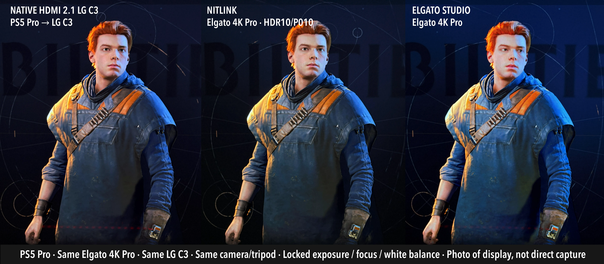
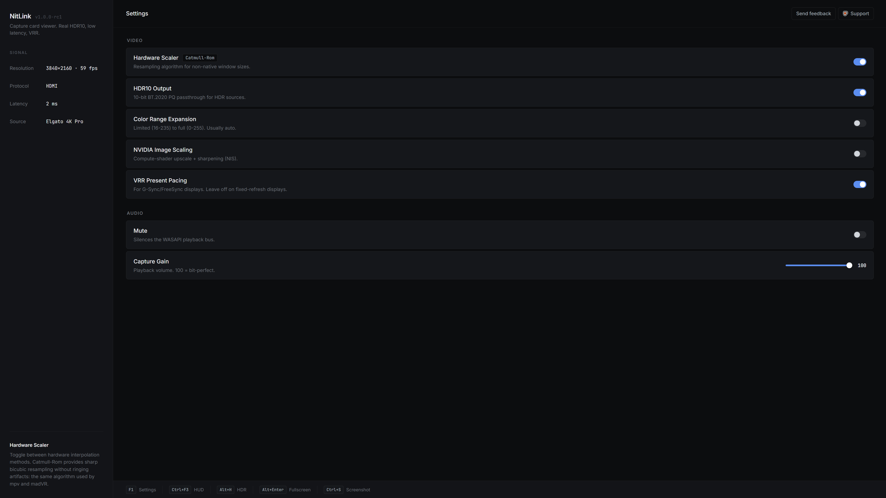
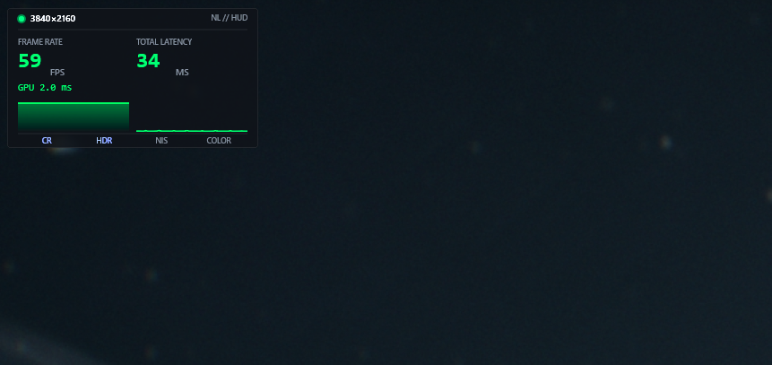
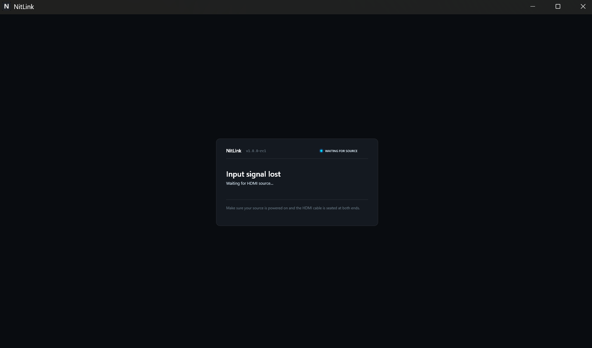

# NitLink

A capture card viewer for Windows. It makes your console feel like part of your PC: same screen, same workflow, real HDR10, VRR, no extra monitor required.

Built and tested on the Elgato 4K Pro (PCIe) and Elgato 4K S (USB).

<p align="center">
  
</p>

<p align="center">
  <em>HDR comparison preview.</em>
</p>

<p align="center">
  <a href="https://youtu.be/btLGDReiK-U">
    
  </a>
</p>

<p align="center">
  <em>Watch the NitLink demo video.</em>
</p>

---

## Why

A 42-inch monitor as a main screen. A PS5. No second monitor, no source swaps. The goal: PS5 as just another window on the PC, something to Alt-Tab to, take screenshots from, see in Discord status, all in the same ecosystem.

The existing options didn't work for that. Elgato Studio tonemaps HDR to SDR for the preview. OBS does the same. Every capture utility treats the preview window as "good enough for monitoring while you record", but that's not gameplay. The goal here is to *play*, with the game looking the way it was actually meant to look.

NitLink: real HDR10, render latency below the perceptible threshold, VRR tracking the actual game framerate, integrated with the PC the way every other window is.

---

## Is this for you?

NitLink is for you if:
- You have a single high-end monitor you use as your main display
- You own a console and want it to feel like part of your PC ecosystem
- You like Alt-Tab, integrated screenshots, Discord status: the whole "everything on one screen" workflow
- You care about HDR and don't want it tonemapped to SDR for the preview
- You play games at variable framerates and want VRR to actually work through the capture pipeline

NitLink is NOT for you if:
- You have a free monitor input and just want pure HDMI passthrough (use the card's built-in HDMI-out, it's literally physics-direct)
- You're primarily recording or streaming (use OBS; NitLink runs alongside it just fine)
- Your console already has a dedicated TV and you're happy with that

---

## What it does

- **Real HDR10 passthrough**: auto-detects HDR sources from the Elgato HDR InfoFrame on cards that expose it, negotiates native 10-bit P010 capture (BT.2020 PQ), presents through an R10G10B10A2 + `DXGI_COLOR_SPACE_RGB_FULL_G2084_NONE_P2020` swap chain. Zero color conversion. The card's internal HDR-to-SDR tonemapper is disabled at startup via the `IKsPropertySet` GUID Elgato exposes for it. On cards where the HDR detection GUID isn't exposed (e.g. the 4K S), NitLink uses the `hdr_enabled` config setting instead: same P010 capture path, just no auto-detect.
- **Low end-to-end latency, measured.** 19.6 ms +/- 0.9 ms on the Elgato 4K Pro and 33.2 ms +/- 0.5 ms on the Elgato 4K S, measured photon-to-photon with a 240fps slow-motion camera. NitLink itself contributes ~1 ms of that (PresentMon-verified); the rest is capture card buffering + bus transfer + the source/display panels. Runs in *Hardware Composed: Independent Flip* mode (`SyncInterval=0`, `AllowsTearing=1`): the same DXGI present path full-screen games use, no DWM composition overhead. See [Performance](#performance) below for the methodology.
- **VRR (G-Sync / FreeSync) in a window.** Capture cards deliver frames at the negotiated rate to Media Foundation regardless of the source's actual framerate (frame duplication at the HDMI signal level). NitLink's GPU frame differ detects which frames are unique content vs duplicates, and only calls `Present()` on unique frames. With Independent Flip + ALLOW_TEARING active, the monitor's VRR follows the actual game framerate: a 30fps quality-mode game locks the monitor to 30Hz, a 60fps performance-mode game locks to 60Hz, variable-framerate content syncs as the game varies. Verified working on LG C3 OLED via the C3's Game Dashboard refresh rate indicator. Defaults to OFF; toggle it on from the F1 settings panel (or set `vrr_present_pacing = true` in `nitlink.json`) when you're on a G-Sync or FreeSync display. Leave OFF on fixed-refresh displays: gating Present on the frame differ collapses cadence to single digits during low-motion content like game intros and splash screens.
- **MJP-style Catmull-Rom resampling**: sharp bicubic without ringing artifacts, the same algorithm used by mpv and madVR.
- **NIS upscaling**: NVIDIA Image Scaling integrated as a compute-shader pass for sharpening at non-native window sizes.
- **HDR-aware HUD overlay**: fps, latency, pipeline status. Composited correctly into the HDR backbuffer at 203-nit paper-white so it doesn't blow out against HDR content.
- **WASAPI audio routing** with volume + mute.
- **Borderless fullscreen** and **picture-in-picture**.
- **Screenshots**: Ctrl+S. HDR captures are tonemapped to SDR for the saved file so they're shareable.
- **Discord Rich Presence** showing playing NitLink. Uses Discord's local IPC pipe only; NitLink itself makes no network connections.
- **Frame-difference based content fps**: the same GPU differ that drives VRR pacing also surfaces the real game framerate in the HUD.
- **Multi-device source picker.** Live capture-device list in the F1 settings sidebar. Click a connected device to switch to it without restarting; the selection is persisted to `nitlink.json` so the same device opens on the next launch. Non-Elgato sources (webcams, third-party cards) are gated cleanly: Elgato-specific paths (HDR auto-detect, 4K S vendor HID tone-map) skip themselves, and P010 is forced to SDR since the HDR pipeline is only validated on Elgato hardware.
- **Smart signal handling.** Brief HDMI handshake windows (PS5 boot logo, source switch, SDR ↔ HDR transitions) keep showing the last good frame instead of flashing the capture card's NO SIGNAL placeholder. Real signal loss is detected by format-tagged content fingerprints with a temporal-stability gate, so legitimate static or low-motion intro content (logos, slow fades, splash screens) doesn't trip the no-signal screen by accident.

<p align="center">
  
</p>

<p align="center">
  <em>F1 settings panel: capture-device picker, HDR, VRR pacing, image scaling, audio, hotkeys.</em>
</p>

---

## Performance

Two measurements: end-to-end latency (the number users feel), and PresentMon (the slice NitLink is responsible for).

### End-to-end latency (measured)

Measured with an iPhone at 240fps slow-motion, framing a wall-clock timer at the HDMI source (a MacBook Pro M4 displaying a millisecond-resolution browser timer) side-by-side with the same timer as displayed in the NitLink window. Latency = (source timer value) - (NitLink-displayed timer value), averaged over 4-5 frame-stepped samples per card. Both cards captured at 60Hz, NV12, RTX 5080, Windows 11, LG C3 OLED in Game mode.

| Capture card           | End-to-end latency    | Notes                |
|------------------------|-----------------------|----------------------|
| Elgato 4K Pro (PCIe)   | **19.6 ms +/- 0.9 ms**| Range 19-21 ms       |
| Elgato 4K S (USB)      | **33.2 ms +/- 0.5 ms**| Range 33-34 ms       |

The 4K Pro is ~14 ms faster end-to-end than the 4K S (about a 41% reduction). This is felt: it's roughly one 60Hz frame's worth of difference, which is the threshold where most people start noticing input lag.

For reference, Elgato officially specs the 4K S at "as low as 30 ms" preview latency through their own Elgato Studio software. The 4K S measurement at 33.2 ms is consistent with that spec. The 4K Pro measurement of 19.6 ms is below it because PCIe has materially lower bus latency than USB, and NitLink's render path is faster than Elgato Studio's (see PresentMon section below).

### Application-side performance (PresentMon)

The numbers above are the *total* photon-to-photon latency. To isolate how much of that is NitLink's own contribution vs the capture card's upstream pipeline, [PresentMon](https://github.com/GameTechDev/PresentMon) was run on 10-second windowed captures:

| Metric                          | Elgato 4K Pro (PCIe) | Elgato 4K S (USB) |
|---------------------------------|----------------------|-------------------|
| Render to Present (median)      | 0.41 ms              | 0.48 ms           |
| Present to on-screen (median)   | 0.49 ms              | 0.60 ms           |
| GPU work per frame (median)     | 1.32 ms              | 1.48 ms           |
| Present mode                    | Hardware Composed: Independent Flip | (same) |

NitLink's slice of the pipeline, from "renderer finished drawing" to "photons leave the panel", is about **1 ms on both cards**. The remaining ~18 ms (Pro) or ~32 ms (4K S) lives upstream of NitLink: HDMI line-scan into the card, the card's internal buffering, the bus transfer (PCIe vs USB), and the Media Foundation source reader. That stage is opaque to PresentMon and dominates the end-to-end number: it's why the cards feel different despite NitLink doing the same work on both.

For comparison, Elgato Studio's render path measures around 11 ms on the same hardware: about 10 ms slower than NitLink per Present(). That's where the 4K Pro's ~10 ms headroom under Elgato's 30 ms spec comes from. NitLink runs in the same DXGI present path full-screen games use (Hardware Composed: Independent Flip, `SyncInterval=0`, `AllowsTearing=1`).

<p align="center">
  
</p>

<p align="center">
  <em>HUD overlay (<code>Ctrl+F3</code>) on live gameplay. Reports content fps from the GPU frame differ, capture and render latency, and the active capture format.</em>
</p>

### What this feels like when actually gaming

Numbers in isolation don't mean much. The numbers above are *capture latency*: from "HDMI signal enters the card" to "photons leave your monitor". For real gameplay you have to add what's upstream: controller polling, game engine processing, the game's own render and present. On a 60 fps PS5 game in performance mode that's roughly 30-60 ms on the console side.

So total controller-to-screen latency through NitLink works out to roughly:

| Setup                  | Total controller to screen | What it feels like |
|------------------------|----------------------------|---------------------|
| NitLink + 4K Pro       | ~60-80 ms                  | Indistinguishable from a TV direct |
| NitLink + 4K S         | ~75-95 ms                  | One 60 Hz frame slower than the Pro |

For reference points:

- **Direct PS5 to TV** is ~50-70 ms total on a good gaming OLED: that's the baseline most console players already accept as "normal".
- **Cloud gaming** (GeForce Now, PS Plus streaming) runs ~80-150 ms.
- **Most non-game-mode TVs** sit at ~80-130 ms.

**4K Pro feels equivalent to playing on a TV.** You wouldn't pass a blind test against a direct HDMI connection unless you're a pro fighting game player with frame-perfect muscle memory.

**4K S feels noticeable on twitch-sensitive content, fine for everything else.** Good for single-player games, RPGs, racing, sports, story-driven content, and casual multiplayer. Borderline for competitive fighting games (frame-perfect combos are harder) and rhythm games (may need calibration offset). Not recommended for top-level ranked competitive shooters where every millisecond matters.

The real comparison: 4K S latency is similar to playing through a 65" LG OLED in Game Mode with a wireless 8BitDo controller, a setup most people would happily call "great". And both cards through NitLink are meaningfully better than any cloud gaming option.

If you're choosing between cards: the 4K Pro is the right pick if you want zero compromises and 4K HDR. The 4K S is the right pick if you can live without 4K HDR and want to save ~$140. Both are real, supported, working setups: not one is "the real product" and the other "a downgrade".

### Tested platforms

NitLink has been hardware-validated on two distinct PC setups, covering both high-end and mid-range gaming hardware and both VRR and fixed-refresh displays:

| Platform | GPU / CPU | RAM / Storage | Display | Cards |
|---|---|---|---|---|
| Desktop | RTX 5080, Windows 11 | 64 GB DDR5 | LG C3 OLED 42" @ 4K 120Hz, G-Sync VRR | 4K Pro (PCIe), 4K S (USB) |
| Acer Nitro 5 — AN515-54-728C | RTX 2060, Intel Core i7-9750H (9th Gen) | 16 GB DDR4, 256 GB NVMe SSD | TUF VG289Q UHD 4k IPS @60Hz, FreeSync HDR10 | 4K S (USB) |

The laptop test specifically informed the rc1 defaults. On a fixed-refresh panel, gating Present on the GPU frame differ (VRR pacing) collapses visible cadence during low-motion content — game intros, slow fades, splash screens — because the differ correctly classifies most of those frames as duplicates and skips `Present()`. With VRR pacing OFF (the rc1 default), playback on the laptop is smooth. Users on G-Sync or FreeSync displays can opt in from the F1 panel.

---

## Known limitations

Honest disclosure of things NitLink does not do and probably can't do without significant changes:

- **Elgato 4K S: 1080p HDR or 4K SDR, not both.** Bus bandwidth caps the 4K S below 4K HDR10. The 4K S uses USB 3.2 Gen 2x1 (10 Gbps), and uncompressed 4K@60 P010 (HDR10) needs roughly 12 Gbps, which doesn't fit. 4K@60 NV12 (SDR) is about 6 Gbps and works fine. The driver itself only publishes P010 at 1080p and 720p, which you can verify in NitLink's `[NitLink/Formats]` debug enumeration. This is a hardware ceiling on the 4K S, not a NitLink limitation. The 4K Pro (PCIe) has the bandwidth headroom for 4K@60 HDR10 with no caveats; the 4K X (USB 3.2 Gen 2x2, 20 Gbps) per Elgato's spec also supports 4K@60 HDR10, but NitLink hasn't been tested on it yet, see [Hardware support](#hardware-support).
- **Elgato 4K S: no HDR auto-detection.** The 4K Pro exposes an Elgato-specific `IKsPropertySet` GUID that NitLink uses to read the live HDR InfoFrame from the source. The 4K S doesn't expose this GUID. As a fallback, NitLink uses the `hdr_enabled` setting in `nitlink.json` to decide whether to negotiate P010. If you're on a 4K S, set `hdr_enabled = true` when you want HDR capture and `false` when you want 4K SDR; NitLink will pick the right MF format on next start.
- **Windows HDR can be temperamental.** Windows 11's Advanced Color Management is generally stable but edge cases exist: moving the NitLink window across monitors with different HDR profiles, certain notification overlays, or background apps with custom ICC profiles can occasionally cause flickering or color desaturation. Closing and reopening NitLink resets the swap chain and resolves it. This is a known Windows limitation that affects all HDR-aware applications.
- **VRR below 40Hz falls back to fixed refresh.** Most VRR displays (including the LG C3) have a minimum refresh rate around 40Hz. Below that, VRR disengages and a safety floor in NitLink presents at ~4Hz to keep DWM happy. For purely static content (dashboards, paused screens with no animation) this is invisible. A future version may add frame doubling to keep sub-30fps content inside the VRR window.
- **HDMI handshake can get sticky when swapping capture devices.** If you swap from one Elgato card to another (or change cables) without restarting the console, the source may negotiate a stale EDID; symptom is black screen with audio, or video locks to 1080p when both ends support 4K. Restarting the console fixes it. Not a NitLink bug, but worth knowing.

<p align="center">
  
</p>

<p align="center">
  <em>Branded no-signal screen. Shown after the grace window expires; during brief HDMI handshake gaps the renderer keeps painting the last good frame instead.</em>
</p>

- **Brief visual artifact during PS5 HDR mode changes.** When you change the PS5's HDR setting mid-session (PlayStation Settings → Screen and Video → HDR), the HDMI link renegotiates between the PS5 and the capture card; NitLink picks up the format change on the next reconcile and re-opens the capture device with the correct pixel format (P010 for HDR, NV12 for SDR), but a frame or two can render with a transient green band on the left edge during the handoff. This is the brief window where the card's MF source has switched stride/format but the renderer's last good frame is still being held. The picture corrects on the next reconcile pass (typically within ~100ms). Not a NitLink bug exactly, just the inherent cost of mid-session format renegotiation; restarting NitLink avoids it entirely if you know in advance you're going to change PS5 HDR mode.
- **Spider-Man 2 framerate on 4K S in 2160p SDR (game-specific).** On the 4K S's NV12 4K@60 SDR path, Marvel's Spider-Man 2 produces fewer unique frames than expected: the PS5 dashboard tile reads ~45fps while other game tiles on the same setup read 60fps, and Performance Pro mode in-game can drop to ~30fps. NitLink's HUD reports these honestly — the HDMI signal itself stays at 60Hz, but the unique-content rate from the PS5 side drops. Switching the 4K S to 1080p HDR (P010) restores Spider-Man 2 to 60fps. Other games tested on the same setup (e.g. Star Wars Jedi: Survivor) run at 60fps in 4K SDR with no issue. This is most plausibly a PS5 / Insomniac / 4K-S-capability interaction rather than a NitLink defect. Workaround: use 1080p HDR for Spider-Man 2 on the 4K S.
- **No frame generation.** Adds latency by definition. Out of scope.
- **No recording or streaming.** Run OBS alongside it for that.

---

## Requirements

- Windows 10 (1809+) or Windows 11
- DirectX 11 capable GPU
- Microsoft Edge WebView2 runtime (preinstalled on Windows 11)
- For HDR: an HDR-capable display + HDR enabled in Windows display settings
- For VRR: a VRR-capable display (G-Sync / FreeSync / HDMI 2.1 VRR) with VRR enabled at the OS and display level
- An Elgato 4K Pro or 4K S (see [Hardware support](#hardware-support) for the full matrix)

### LG OLED notes

If you're on an LG OLED TV (C2, C3, C4, G3, etc.) and want the best HDR fidelity, change the HDMI input icon from "PC" to "Game Console" in the TV's input settings. This switches the panel into HDR Game picture mode, which preserves shadow detail and applies the correct tone-mapping curve. Without this, the TV may pick a more conservative HDR mode that lifts blacks. NitLink's HDR10 metadata (BT.2020 / 1000-nit mastering / MaxCLL 1000 / MaxFALL 400) helps the TV pick the right mode, but the input-type setting is the deciding factor on LG firmware.

For VRR on LG OLEDs, make sure G-Sync VRR is enabled in `Settings -> All Settings -> General -> Game Optimizer -> VRR & G-Sync`. The Game Dashboard (gear button on the remote) will show "G-SYNC VRR" when it's active and the real-time refresh rate NitLink is driving.

---

## Hardware support

| Device | Status |
|---|---|
| Elgato 4K Pro (PCIe) | ✅ Tested and validated. 4K@60 HDR10 + VRR pacing, HDR auto-detect via Elgato property GUID, hardware tonemap controlled through `IKsPropertySet`. |
| Elgato 4K S (USB) | ✅ Tested and validated. 4K@60 SDR (NV12) or 1080p@60 HDR10 (P010) + VRR pacing. HDR tonemap controlled through vendor HID Output Report (see `docs/4ks-hdr-tonemap.md`); HDR source state driven by `hdr_enabled` config setting since the 4K S does not expose an HDR auto-detect property. |
| Elgato 4K X | ❓ Untested. Same Media Foundation path as the 4K Pro, expected to work. |
| Other Elgato cards | ❓ Untested |
| AverMedia / Magewell / Razer | ❓ Untested |

NitLink uses the Media Foundation source reader, which works with any DirectShow / WDM video capture device. The Elgato-specific bits (HDR auto-detect via `IKsPropertySet`, hardware tonemap disable) silently no-op on cards that don't expose those properties; SDR capture should still work fine. The frame format negotiator now prefers NV12 over RGB32 for SDR (about 2.7x less bandwidth), which lets USB cards deliver 4K@60 instead of silently downgrading to 1080p; row order is detected empirically via `MF_MT_DEFAULT_STRIDE` so cards with different conventions render right-side-up.

If you have a different card and want NitLink to officially support it, open an issue with: card model, OS version, what you saw, and the `[NitLink/Formats]` lines from the Debug Output window.

---

## Build

NitLink uses CMake. Tested with Visual Studio 2022 / 2026 Insiders.

```
git clone https://github.com/nitlink-dev/nitlink
cd nitlink
```

In Visual Studio:
1. `File -> Open -> CMake...` and pick `CMakeLists.txt`
2. Wait for CMake to generate
3. Select the `x64-Release` configuration
4. `Build -> Build All`

Or from the command line (Developer Command Prompt for VS 2022):
```
cmake -B build -G "Visual Studio 17 2022" -A x64
cmake --build build --config Release
```

Output binary lands at `out/build/x64-Release/NitLink.exe` (VS) or `build/Release/NitLink.exe` (CLI). The build step also copies `nitlink-menu.html` and `third_party/nis/NIS_Scaler.h` next to the .exe (both needed at runtime).

---

## Hotkeys

| Key | Action |
|---|---|
| `F1` | Open / close settings menu |
| `Alt + H` | Toggle HDR manually (override the auto-detect) |
| `Alt + Enter` | Toggle fullscreen |
| `Alt + P` | Toggle picture-in-picture |
| `Ctrl + F3` | Toggle HUD overlay |
| `Ctrl + S` | Save screenshot to `Pictures/NitLink/` |

On 4K Pro: HDR auto-follows the source by default. When NitLink starts and the connected source is sending HDR10 (e.g. PS5 in HDR mode), HDR mode turns on automatically. When the source is SDR, HDR turns off. Alt+H is a manual override.

On 4K S: HDR auto-detection isn't available, so the `hdr_enabled` setting in `nitlink.json` decides the capture format at startup. Alt+H still toggles the renderer's HDR mode at runtime (useful for comparison) but the underlying capture format (P010 vs NV12) is locked at startup.

---

## Configuration

Settings live in `nitlink.json` next to the executable. Plain text; auto-saves on every toggle so a crash never costs you your setup. Keys of interest:

- `hdr_enabled`: toggle HDR mode. On 4K Pro this is overridden by auto-detection; on 4K S this is what NitLink uses to decide whether to negotiate P010 at startup.
- `vrr_present_pacing`: toggle VRR pacing (default `false`). Set to `true` on G-Sync / FreeSync displays so monitor VRR tracks the source's real unique-frame rate; leave `false` on fixed-refresh displays to keep Present cadence smooth during low-motion content. Also toggleable from the F1 settings panel.
- `nis_enabled` / `nis_sharpness` / `nis_scale_mode`: NIS upscaler config
- `color_expansion`: limited (16-235) to full (0-255) range expansion. Off by default. NitLink reads the source's nominal range from `MF_MT_VIDEO_NOMINAL_RANGE` and automatically skips this expansion when the driver reports full-range output (e.g. some 4K S NV12 modes deliver pre-expanded 0-255). You generally don't need to touch this.
- `audio_volume` / `audio_muted`: playback level

---

## Architecture

Pure DirectX 11. No D3D12, no Vulkan. Capture frames arrive via Media Foundation on a worker thread, hit a double-buffered frame queue, and run through the render pipeline:

```
PS5 HDMI
  │
  ▼
Elgato 4K Pro / 4K S (hardware tonemap disabled when supported)
  │
  ▼
Media Foundation
  P010 negotiated for HDR10 source
  NV12 preferred for SDR (RGB32 fallback)
  Row order detected via MF_MT_DEFAULT_STRIDE
  Nominal range detected via MF_MT_VIDEO_NOMINAL_RANGE
  │
  ▼
GPU upload (DYNAMIC texture, MAP_WRITE_DISCARD)
  │
  ▼
GPU frame differ (640x360 SAD pass) classifies unique vs duplicate
  │
  ▼ (only if unique frame OR safety floor expired)
  │
Capture shader
  P010 -> BT.2020-PQ passthrough
  NV12 / BGRA -> Catmull-Rom + range-aware decode
  │
  ▼
Optional NIS upscale (compute shader, 1x to 2x)
  │
  ▼
HUD / settings overlay composite (203-nit paper-white when HDR)
  │
  ▼
DXGI flip-discard waitable swap chain
  R10G10B10A2 + HDR10 PQ BT.2020 when HDR
  BGRA8 when SDR
  SetMaximumFrameLatency(1), ALLOW_TEARING
  │
  ▼
LG C3 OLED (Game mode, G-Sync VRR active)
```

The frame differ runs at 640x360 working resolution with hysteresis classification (two thresholds with sticky state) to prevent oscillation when source diff values sit near the decision boundary. This is what makes VRR pacing stable on subtle content like character idle animations in pause menus.

The HUD overlay renders with Direct2D + DirectWrite. In SDR it paints the backbuffer directly; in HDR it can't (D2D doesn't support R10G10B10A2 with HDR10 PQ output), so it draws into a BGRA8 offscreen which the renderer composites in via a sRGB-to-PQ pixel shader at 203-nit paper-white.

The settings menu is HTML/CSS rendered inside an embedded WebView2 control as a child window of the main HWND. C++ to JS communication goes through `window.chrome.webview.postMessage` in both directions.

---

## Project layout

```
src/
├── main.cpp           : WinMain, COM/MF init
├── app/               : Application class, config, WebView2 settings bridge, game database
├── audio/             : WASAPI audio routing
├── capture/           : MF device + frame buffer + Elgato HDR control + frame differ
├── discord/           : Discord RPC client
├── input/             : Global hotkey manager
├── overlay/           : D2D HUD overlay + branded no-signal screen
├── renderer/          : DX11 swap chain, shaders, window
├── ui/                : Theme tokens
└── upscale/           : NIS upscaler integration

third_party/           : NIS, WebView2, WIL
```

---

## Scope

NitLink does one thing: makes your console feel like part of your PC. It's not a recording tool, not a streaming tool, not an OBS replacement. For recording and streaming, run OBS alongside it.

---

## License

MIT. See `LICENSE`.

Third-party licenses (NIS, WebView2, WIL, MJP's Catmull-Rom) in `LICENSES.md`.

---

## Acknowledgments

- **Matt Pettineo (TheRealMJP)**: the Catmull-Rom bicubic implementation used in NitLink's resampling shaders is adapted from his public reference. MIT licensed.
- **NVIDIA**: NIS SDK.
- **Microsoft**: WIL, WebView2.
- **Brandon (13bm), [elgato4k-linux](https://github.com/13bm/elgato4k-linux)**: 4K S HID protocol reference. See [`ACKNOWLEDGMENTS.md`](ACKNOWLEDGMENTS.md) and [`docs/4ks-hdr-tonemap.md`](docs/4ks-hdr-tonemap.md).

---

## Support development

NitLink is built by one developer. If it's useful to you, here are the concrete things donations would fund next:

- **$200: Elgato 4K X testing.** Buy a 4K X to add official support and benchmark its latency alongside the 4K Pro and 4K S.
- **$300: AVerMedia Live Gamer Ultra support.** Buy an LGU, integrate into the format negotiator, validate end-to-end so users with existing AverMedia hardware can use NitLink.

Support development at [ko-fi.com/klosed89](https://ko-fi.com/klosed89). Progress against these milestones will be tracked in the changelog as they're hit.

The core NitLink viewer in this repo is free, MIT-licensed, and will stay that way. No telemetry, no ads, no bundled junk in the app you download from here. Your support funds hardware testing and distribution costs.

Bug reports and PRs welcome on the issue tracker.

---

*NitLink is an independent software application. It is not affiliated with, authorized, sponsored, or endorsed by Corsair Gaming, Inc., Elgato Systems LLC, or their affiliates. All registered trademarks, including "Elgato", "4K Pro", "4K X", "4K S", and "4K Capture Utility", are the property of their respective owners.*
