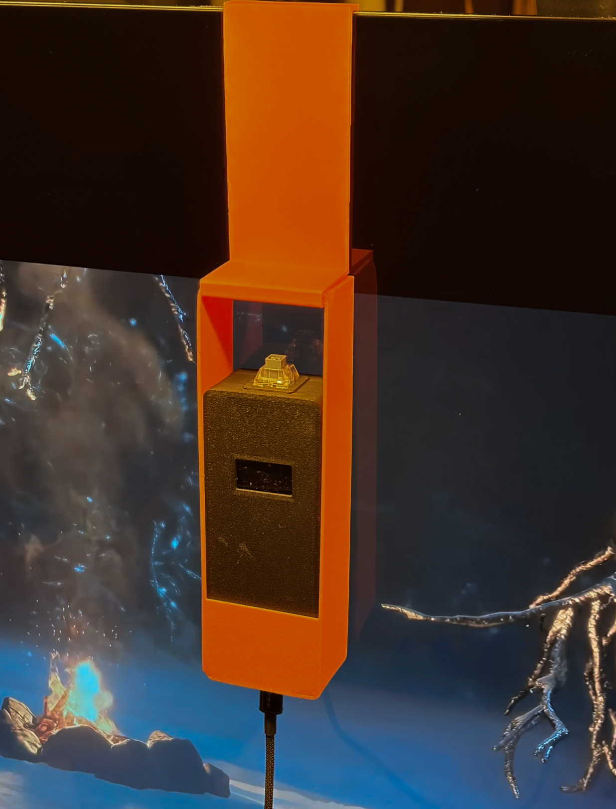
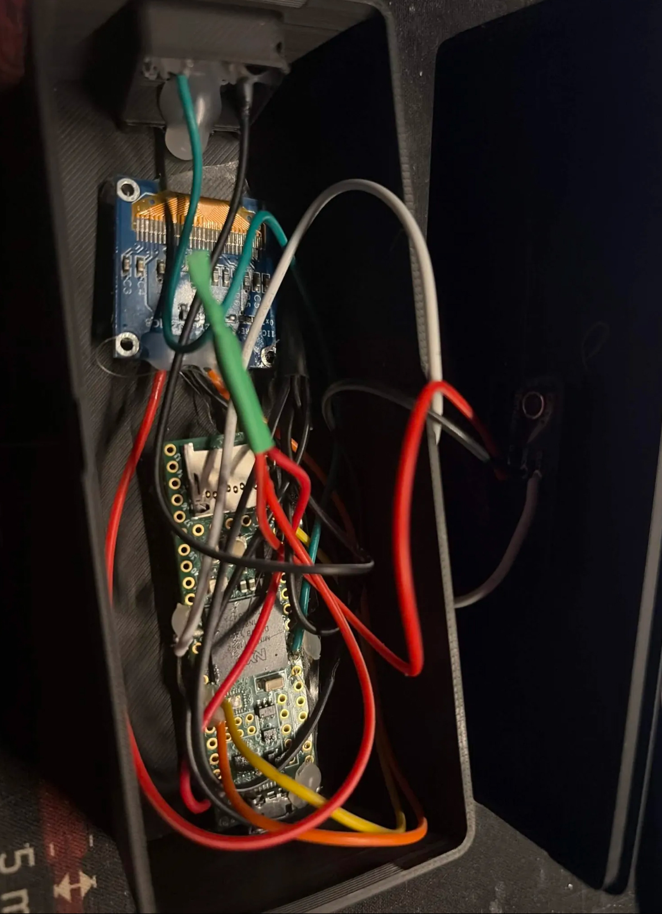

# NitLink latency measurements

How the latency claims in the README were measured, the complete results, and the raw data.

## Summary

NitLink was measured back-to-back against Elgato's own capture software (4K Capture Utility) on three cards using a hardware photon rig. Within each card, NitLink came out ahead on the 4K Pro and the 4K S, and statistically tied on the 4K X at 4K120. It did not lose on any card or mode tested.

All figures are same-rig, same-session comparisons. Absolute milliseconds include the rig's own constant path and depend on the display and the sensor threshold, so they are not comparable across sessions or across setups. The within-session difference between two viewers on identical hardware is the meaningful number.

## Measured configuration

- NitLink 1.1 pre-release build. Low-Latency Mode on (the default), fullscreen, Media Foundation capture (the default path).
- Present: tearing-allowed flip-model present, rate-capped at 117 Hz on a 120 Hz variable-refresh panel so the display's variable refresh engages. The measured runs pinned the cap with a `VRR_CAP.txt` file next to `NitLink.exe` containing the target rate in Hz. In 1.1.0 the cap is automatic: monitor refresh minus 3 Hz, applied when that stays at or above the source frame rate, so the same 120 Hz panel lands on the same 117 Hz; `present_cap_hz` in `nitlink.json` overrides it, and the marker file still wins when present. See "Why the present-rate cap matters" below.
- NVIDIA Control Panel Vertical Sync set to "Use the 3D application setting" and the display's variable refresh (G-Sync Compatible) enabled. A driver-forced vsync sits above the application and silently defeats the tearing present.
- Display: LG C3 OLED 42" at 120 Hz. GPU: NVIDIA RTX 5080. Windows 11.
- Comparison software: Elgato 4K Capture Utility, same card, same display, run immediately after the NitLink batch with nothing else changed.

## The rig

- Teensy 4.x microcontroller with a TEMT6000 light sensor in a 3D-printed housing, held against the PC display by a bracket that hooks over the bezel. The housing sat at one fixed position for every batch of the June 5 run.
- A button on the Teensy triggers, over USB serial, a small program on a Mac that paints its screen white. The Mac's HDMI output is the capture source. The Teensy timestamps the button press and the moment the sensor sees the PC display brighten.
- One sample covers the whole chain: button press, Mac frame, HDMI, capture card, viewer application, PC display, sensor. The Mac and serial portion is identical for every application under test, so it cancels out of any within-session comparison.
- Rise threshold: 50 ADC counts above baseline. A threshold that trips near the flash peak penalizes a tearing present (gradual brightness rise) relative to a vsync present (sharp rise), so the NitLink margins reported here are a floor rather than a ceiling.
- 100 samples per batch. Medians are reported; means, standard deviations, minimums and maximums are in the tables.

  

  <em>The rig on the test display: a 3D-printed bracket hooks over the bezel and holds the sensor housing against the panel at a fixed spot. The trigger switch sits on top; the USB cable runs to the Mac.</em>

  

  <em>Inside the housing: Teensy 4.x, the 128x64 OLED that shows live statistics, the TEMT6000 light sensor, and the switch wiring.</em>

## Results: June 5, 2026 (authoritative run)

Same sensor position for all six batches, fresh NitLink launch per card, NitLink batch followed by the Elgato batch back-to-back.

| Card / source mode | NitLink median | Elgato median | Difference | Result |
|---|---|---|---|---|
| 4K Pro @ 1080p144 | **38.4 ms** | 44.2 ms | NitLink −5.9 ms (13%; about 7.7× the standard error; 84 of 100 NitLink samples under the Elgato median) | NitLink ahead |
| 4K X @ 4K120 | **47.7 ms** | 48.4 ms | −0.8 ms (about 0.8× the standard error; 59 of 100) | Statistical tie |
| 4K S @ 4K60 | **67.8 ms** | 75.1 ms | NitLink −7.3 ms (10%; about 5.1× the standard error; 79 of 100) | NitLink ahead |

All six batches, in milliseconds:

| Batch | Median | Mean | Std. dev. | Min | Max |
|---|---|---|---|---|---|
| 4K Pro, NitLink (1080p144) | 38.4 | 38.8 | 4.7 | 30.3 | 51.1 |
| 4K Pro, Elgato (1080p144) | 44.2 | 44.3 | 3.9 | 34.6 | 53.1 |
| 4K X, NitLink (4K120) | 47.7 | 48.1 | 5.4 | 36.3 | 64.6 |
| 4K X, Elgato (4K120) | 48.4 | 49.3 | 5.1 | 41.7 | 69.2 |
| 4K S, NitLink (4K60) | 67.8 | 68.9 | 7.8 | 55.5 | 101.8 |
| 4K S, Elgato (4K60) | 75.1 | 74.8 | 8.1 | 62.2 | 112.5 |

Each card ran at its own source mode, so these are NitLink-versus-Elgato comparisons per card, not a ranking of the cards against each other.

## Earlier sessions

Latency work ran from June 2 to June 5, 2026. The sessions before June 5 used a previous revision of the rig (hand-positioned sensor, different thresholds, hardware changes between runs), so neither their absolute values nor their within-session differences are reported here. Their orderings pointed the same way as the final run, but only the June 5 measurements on the final rig are treated as evidence.

## Why the present-rate cap matters

A vsync present (`Present(1, 0)`) never engages variable refresh: the panel runs at its fixed maximum and every viewer pays the wait for the next vertical blank. Variable refresh engages only with a tearing-allowed present, and an uncapped tearing present (hundreds of presents per second) overshoots the panel's ceiling and simply tears. Capping the tearing present a few hertz under the panel's maximum keeps it inside the variable-refresh window: the panel refreshes as each frame is presented, with no vertical-blank wait and no visible tearing. This is the same vsync-off plus frame-cap setup recommended for G-Sync and FreeSync gaming.

Development sessions before the final run showed the effect directly on an earlier rig revision: the same NitLink build went from slower than every other viewer with an uncapped tearing present to faster than all of them with the cap in place, changing nothing but how it presented. Those sessions are not reported here for the reason given above.

PresentMon, which is independent of the photon rig, corroborates the mechanism. With the tearing present and variable refresh engaged, NitLink presents through Hardware Composed: Independent Flip with a present-to-glass time of about 1 ms. With a vsync present, every viewer including NitLink pays roughly 8 to 11 ms waiting for the next vertical blank.

## Caveats

1. **Within-card comparisons only.** Each card was tested at a different source mode, so nothing here ranks one card against another.
2. **The margins are a floor.** The flash was dim (sensor peaks of roughly 75 to 85 counts) and the threshold trips near the peak, which penalizes NitLink's gradual tearing rise relative to Elgato's sharp vsync jump. The real NitLink margins are likely larger, and the 4K X tie likely leans toward NitLink.
3. **Cam Link 4K could not be compared.** Elgato's software does not open it (it is a generic UVC device), so no NitLink-versus-Elgato pair exists for it.
4. **Absolute values are rig-specific.** They include the Mac and serial path and depend on the display. Real gameplay adds the console's own latency (controller polling, game logic, render and present, typically 30 to 60 ms at 60 fps) on top of the capture path measured here.
5. **One test system.** All latency figures come from the RTX 5080 and LG C3 system above. A second machine (RTX 2060 laptop, 60 Hz FreeSync monitor) was used for functional testing of the 4K S, not for latency.
6. **The comparison software is Elgato's.** No other viewer is included in the reported run.
7. **One authoritative run.** Earlier sessions used a previous rig revision and are excluded (see Earlier sessions).

## Raw data

Every sample from the June 5 run is in [`latency-raw.csv`](latency-raw.csv): date, card, source mode, application, sample index, latency in microseconds and in milliseconds. Six batches, 100 samples each.
